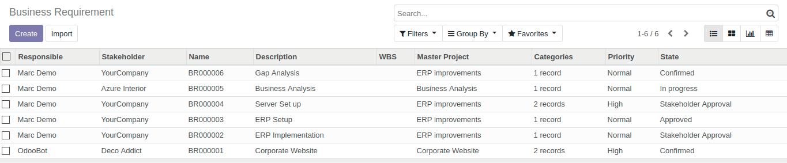
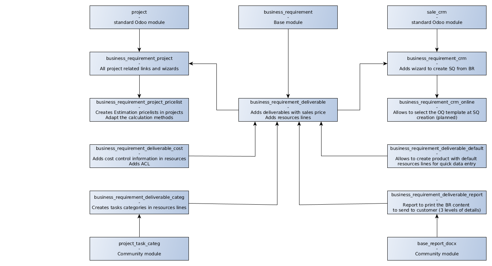
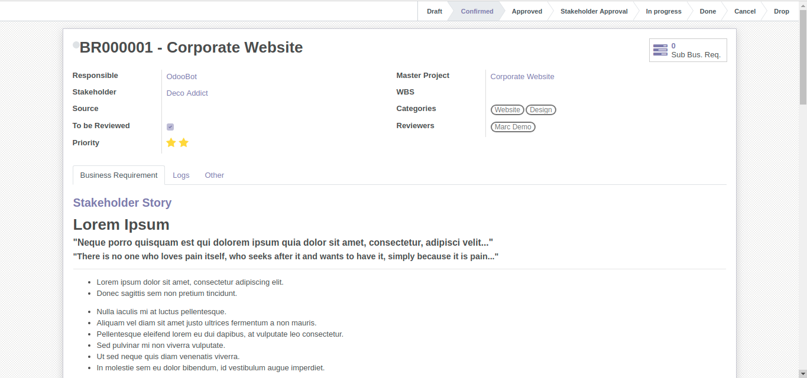
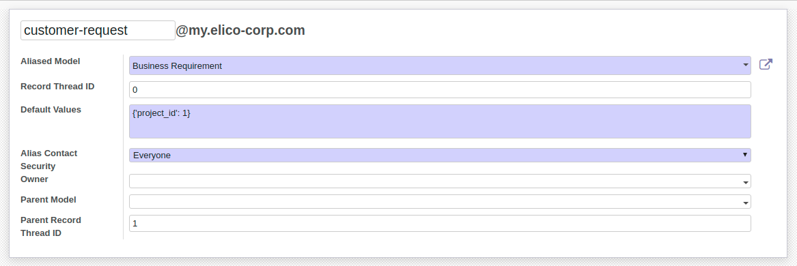
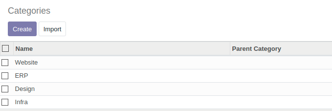

.. image:: https://img.shields.io/badge/licence-AGPL--3-blue.svg
   :target: https://www.gnu.org/licenses/agpl-3.0-standalone.html
   :alt: License: AGPL-3

====================
Business Requirement
====================

Introduction
============

What is a Business Requirement?
-------------------------------

A **Business requirement** (BR) is the expression of a business need by a customer 
or internal project user.

A BR contains multiple different parts to explain the stakeholder need and how to 
meet his/her requirements:

* **Customer Story**: this is the requirement as expressed by the customer
* **Scenario**: How/where the current solution can provide a suitable scenario to 
  answer the customer story
* **Gap**: For the uncovered part of the scenario, elaborate the gap/need for specific 
  developments/setup
* **Test case**: A set of conditions under which a tester will determine whether the application, software system or
  one of its features is working as it was originally established for it to do. 
* **Deliverables** to be provided to the customer/user
* **Resources** necessary to achieve the deliverables
* **Additional** information (approval, cost control etc.)

This set of modules was originally designed for the service/IT industry but the 
requirement management design has been kept as generic as possible so that it can 
apply to many other cases/industries (customer or internal projects):

* Construction
* Trading (New product development)
* Business Consultancy
* Web or IT development
* R&D projects
* etc.

More information about business requirements management:

* `Wikipedia <https://en.wikipedia.org/wiki/Business_requirements>`_
* `Six Sigma <https://www.isixsigma.com/implementation/project-selection-tracking/business-requirements-document-high-level-review/>`_

Business Requirement set of modules
-----------------------------------

This module is part of a set (`Business Requirements repo <https://github.com/OCA/business-requirement/tree/10.0>`_).

The base Business Requirements module creates the basic objects and 
can be used as a standalone module.

Multiple modules integrate the BR with other business areas, such as Sales, 
Procurement, Project or Analytic Accounting. For example:

* Sales Quotation can have an estimation supported by a BR analysis
* Project Tasks can be related to the BRs they implement or support
* Procurement and purchase can be generated out of the BR

The following workflow explains the business workflow between the BR modules and other applications in Odoo:

.. figure:: ../business_requirement/static/img/bus_req_workflow.png
   :width: 600 px
   :alt: Business Requirement integration in Odoo

How to use this module?
-----------------------

This module only contains the standard base models for business requirement:

* BR model definition
* Standard setup and views
* Standard Workflow

Configuration
=============

Users
-----

* **Business Requirement User**: can create and confirm a BR
* **Business Requirement Manager**: can create, confirm and approve a BR

Alias and emails
----------------
You can setup an alias in Settings/Technical/Email/Alias in order to create 
business requirements directly from email received at a specific address.

You can start conversation with the followers in the chatter area of the 
BR like in tasks, issue or CRM leads.

Sequences
---------

Default numbering format: BR123456.

You can modify the default numbering sequence in Settings/Technical/Sequences&Identifier/Sequences.

Search for Business Requirement sequence and alter it if necessary.

Tags
----

You can create and assign tags for your business requirements in Business Requirements/Configuration/Bus. Req. Category

Master project
--------------

You can define a master project linked to the business requirement.

Followers from the project will automatically be added to the business requirements.

Usage
=====
Simple BR
---------

1. Define the header information

   * Master Project (Partner is the one related to the master project)
   * Priority (low, Medium, High)
   * Change request: Is it a change request? (currently only informational with n model or action)
   * Tags: any relevant tag for the business.
   * Owner and approver by default
   
   .. figure:: ../business_requirement/static/img/bus_req_tags2.png
      :width: 600 px
      :alt: Input header information
   
2. Input the customer story, scenario gap and test case(simple html editor with image and text)

   .. figure:: ../business_requirement/static/img/bus_req_cust_story.png
      :width: 600 px
      :alt: Input customer story, scenario, gap and test case
   
3. Confirm the Business requirement (for BR User and Manager)
   At that stage the Customer story/Scenario/Gap/Test case is not modifiable anymore

   .. figure:: ../business_requirement/static/img/bus_req_confirmed.png
      :width: 600 px
      :alt: Confirm your business requirement
    
4. Approve the Business requirement (for BR Manager)

   .. figure:: ../business_requirement/static/img/bus_req_approved.png
      :width: 600 px
      :alt: Confirm your business requirement
    
5. Once your requirement is finished and delivered you can set it as Done

   .. figure:: ../business_requirement/static/img/bus_req_done.png
      :width: 600 px
      :alt: Confirm your business requirement
    
6. Alternatively, you can cancel the BR (in case it is not relevant or mistake) or drop it (when customer makes the decision to discontinue it)

   .. figure:: ../business_requirement/static/img/bus_req_cancel.png
      :width: 600 px
      :alt: Cancel your business requirement
    
    
   .. figure:: ../business_requirement/static/img/bus_req_drop.png
      :width: 600 px
      :alt: Drop your business requirement
    

Sub-business requirements
-------------------------
User can create sub business requirements for a given BR for complex cases.

This is a simple parent/child relation (see roadmap).

.. figure:: https://odoo-community.org/website/image/ir.attachment/5784_f2813bd/datas
   :alt: Try me on Runbot
   :target: https://runbot.odoo-community.org/runbot/222/10.0

Known issues / Roadmap
======================

* Multi-company management
* Full change request management
* Analytic account management
* Complex relationship management
* Integration with earned-value module.
* Improve the followers details (eg: depending on the stages)
* Focus should be on description field (When BR form open it direct focus on
use-case field).

Bug Tracker
===========

Bugs are tracked on `GitHub Issues <https://github.com/OCA/business-requirement/issues>`_.
In case of trouble, please check there if your issue has already been reported.
If you spotted it first, help us smashing it by providing a detailed and welcomed feedback.

Credits
=======

Contributors
------------

* Eric Caudal <eric.caudal@elico-corp.com>
* Alex Duan <alex.duan@elico-corp.com>
* Xie XiaoPeng <xie.xiaopeng@elico-corp.com>
* Victor M. Martin <victor.martin@elico-corp.com>
* Evan Li <li.aiwen@elico-corp.com>

Maintainer
----------

.. image:: https://odoo-community.org/logo.png
   :alt: Odoo Community Association
   :target: https://odoo-community.org

This module is maintained by the OCA.

OCA, or the Odoo Community Association, is a nonprofit organization whose
mission is to support the collaborative development of Odoo features and
promote its widespread use.

To contribute to this module, please visit https://odoo-community.org.
