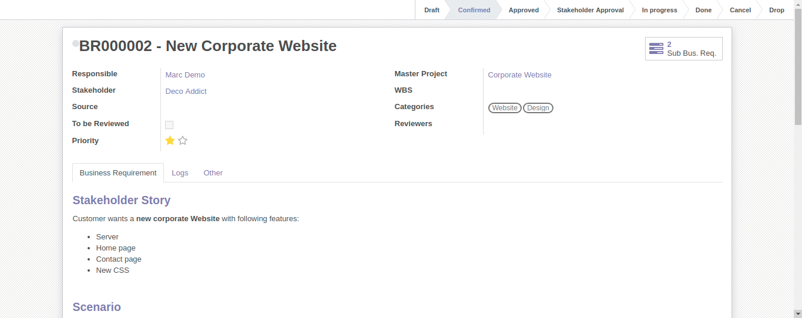

.. image:: https://img.shields.io/badge/licence-AGPL--3-blue.svg
   :target: https://www.gnu.org/licenses/agpl-3.0-standalone.html
   :alt: License: AGPL-3

====================
Business Requirement
====================

Introduction
^^^^^^^^^^^^

This module is part of a set ("Business Requirement").
The Business Requirements features start as independent entities, and can be used as standalone.
Additional modules integrate them with other business areas, such as Sales, Procurement, Project or Analytic Accounting.
So a Quotation can have an estimation supported by a BR analysis, and Project Tasks can be related to the BRs they implement or support.

|image7|

The following diagram gives a simplified view of the universe:

|image11|

.. |image11| image:: static/img/bus_req_module_diag.png
   :width: 800 px
   :alt: Business Requirement modules diagram

What is a Business Requirement?
^^^^^^^^^^^^^^^^^^^^^^^^^^^^^^^

A Business requirement (BR) is the expression of a business need by a customer 
or internal project user. 
A BR can contain multiple different parts depending on the company needs:

* Customer Story: this is the requirement as expressed by the customer
* Scenario: How/where the current solution can provide a suitable scenario to 
  answer the customer story
* Gap: For the uncovered part of the scenario, elaborate the gap/need for specific 
  developments/setup
* Deliverables to be provided to the customer/user
* Resources necessary to achieve the deliverables
* Additional information (approval, cost control etc.)

These modules were originally design for the service/IT industry but the 
requirement management is generic and can apply to many cases/industries (customer 
or internal projects):

* Construction
* Trading (New product development)
* Business Consultancy
* IT development

What is the difference between a BR and CRM lead?

* CRM leads are sales oriented
* BR are project and workload estimation oriented

How to use this module?
^^^^^^^^^^^^^^^^^^^^^^^

This module only contains the standard models for business requirement:

* BR model definition
* Standard setup and views
* Standard Workflow

|image0|

Installation
============

No specific steps required

Configuration
=============

Users
^^^^^

* **Business Requirement User**: can create and confirm a BR
* **Business Requirement Manager**: can create, confirm and approve a BR

Alias and emails
^^^^^^^^^^^^^^^^
You can setup an alias in Settings/Technical/Email/Alias in order to create 
business requirements directly from email received at a specific address.

|image1|

You can start conversation with the followers in the chatter area of the 
BR like in tasks, issue or CRM leads.

Sequences
^^^^^^^^^

Default numbering format: BR123456.

You can modify the default numbering sequence in Settings/Technical/Sequences&Identifier/Sequences.

Search for Business Requirement sequence and alter it if necessary.

Tags
^^^^

You can create and assign tags for your business requirements in Business Requirements/Configuration/Bus. Req. Category

|image2|

Master project
^^^^^^^^^^^^^^

You can define a master project linked to the business requirement.

Followers from the project will automatically be added to the business requirements.

Usage
=====

Simple BR
^^^^^^^^^
1. Define the header information

* Master Project (Partner is the one related to the master project)
* Priority (low, Medium, High)
* Change request: Is it a change request? (currently only informational with n model or action)
* Tags: any relevant tag for the business.
* Owner and approver by default

|image3|

2. Input the customer story, scenario and gap (simple html editor with image and text)

|image4|

3. Confirm the Business requirement (for BR User and Manager)
   At that stage the Customer story/Scenario/Gap is not modifiable anymore

|image5|

4. Approve the Business requirement (for BR Manager)

|image6|

5. Once your requirement is finished and delivered you can set it as Done

|image8|

6. Alternatively, you can cancel the BR (in case it is not relevant or mistake) or drop it (when customer makes the decision to discontinue it)

|image9|

|image10|

Sub-business requirements
^^^^^^^^^^^^^^^^^^^^^^^^^
User can create sub business requirements for a given BR for complex cases.

This is a simple parent/child relation (see roadmap).

.. image:: https://odoo-community.org/website/image/ir.attachment/5784_f2813bd/datas
   :alt: Try me on Runbot
   :target: https://runbot.odoo-community.org/runbot/140/8.0

Known issues / Roadmap
======================

* Multi-company management
* Full change request management
* Analytic account management
* Complex relationship management
* Integration with earned-value module.
* Improve the followers details (eg: depending on the stages)

Bug Tracker
===========

Bugs are tracked on `GitHub Issues <https://github.com/OCA/business-requiremen/issues>`_.
In case of trouble, please check there if your issue has already been reported.
If you spotted it first, help us smashing it by providing a detailed and welcomed feedback.

Credits
=======

Images
------

* Odoo Community Association: `Icon <https://github.com/OCA/maintainer-tools/blob/master/template/module/static/description/icon.svg>`_.

Contributors
------------

* Eric Caudal <eric.caudal@elico-corp.com>
* Alex Duan <alex.duan@elico-corp.com>
* Xie XiaoPeng <xie.xiaopeng@elico-corp.com>
* Victor M. Martin <victor.martin@elico-corp.com>

Maintainer
----------

.. image:: https://odoo-community.org/logo.png
   :alt: Odoo Community Association
   :target: https://odoo-community.org

This module is maintained by the OCA.

OCA, or the Odoo Community Association, is a nonprofit organization whose
mission is to support the collaborative development of Odoo features and
promote its widespread use.

To contribute to this module, please visit https://odoo-community.org.
