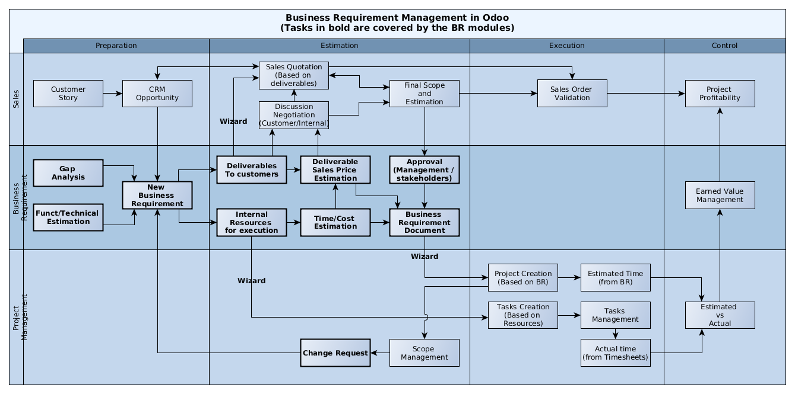

A **Business requirement** (BR) is the expression of a business need by a customer
or internal project user.

A BR contains multiple different parts to explain the stakeholder need and how to
meet his/her requirements:

* **Customer Story**: this is the requirement as expressed by the customer
* **Scenario**: How/where the current solution can provide a suitable scenario to
  answer the customer story
* **Gap**: For the uncovered part of the scenario, elaborate the gap/need for specific
  developments/setup
* **Test case**: A set of conditions under which a tester will determine whether the application, software system or
  one of its features is working as it was originally established for it to do.
* **Deliverables** to be provided to the customer/user
* **Resources** necessary to achieve the deliverables
* **Additional** information (approval, cost control etc.)

This set of modules was originally designed for the service/IT industry but the
requirement management design has been kept as generic as possible so that it can
apply to many other cases/industries (customer or internal projects):

* Construction
* Trading (New product development)
* Business Consultancy
* Web or IT development
* R&D projects
* etc.

More information about business requirements management:

* `Wikipedia <https://en.wikipedia.org/wiki/Business_requirements>`_
* `Six Sigma <https://www.isixsigma.com/implementation/project-selection-tracking/business-requirements-document-high-level-review/>`_

Business Requirement set of modules
~~~~~~~~~~~~~~~~~~~~~~~~~~~~~~~~~~~

This module is part of a set (`Business Requirements repo <https://github.com/OCA/business-requirement/tree/12.0>`_).

The base Business Requirements module creates the basic objects and
can be used as a standalone module.

.. figure:: ../static/img/bus_req_tree.png
   :width: 600 px
   :alt: Business Requirement List view

Multiple modules integrate the BR with other business areas, such as Sales,
Procurement, Project or Analytic Accounting. For example:

* Sales Quotation can have an estimation supported by a BR analysis
* Project Tasks can be related to the BRs they implement or support
* Procurement and purchase can be generated out of the BR

.. figure:: ../static/img/bus_req_module_diag.png
   :width: 600 px
   :alt: Business Requirement modules diagram

The following workflow explains the business workflow between the BR modules and other applications in Odoo:

How to use this module?
~~~~~~~~~~~~~~~~~~~~~~~

The current module only contains the standard base models for business requirement:

* BR model definition
* Standard setup and views
* Standard Workflow

.. figure:: ../static/img/bus_req.png
   :width: 600 px
   :alt: Business Requirement Form