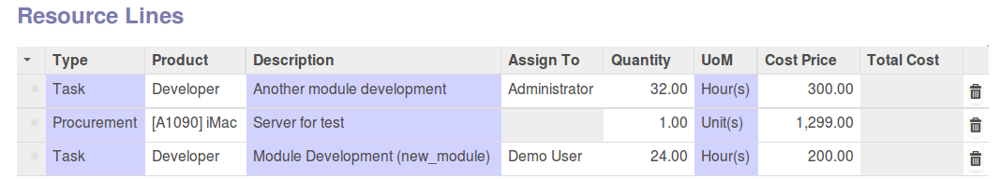

.. figure:: https://img.shields.io/badge/licence-AGPL--3-blue.svg
   :target: https://www.gnu.org/licenses/agpl-3.0-standalone.html
   :alt: License: AGPL-3

================================
Business Requirement Deliverable
================================

Introduction
============

This module is part of a set of modules (`Business Requirements <https://github.com/OCA/business-requirement/blob/8.0/README.md>`_) 

Two new concepts complement the main business requirements model:

* Deliverable lines
* Resource lines

What is a Deliverable Line?
---------------------------

Deliverable Lines (DL) contains products and services that will be delivered to the 
customer. They are **customer oriented** and can be either physical or service products:

* Servers and procured goods
* Gap analysis services
* Module development services
* Training etc.

These are the products that will appear in the SO and that the customer/stakeholder will receive.

.. figure:: ../business_requirement_deliverable/static/img/bus_req_deliverable.png
   :width: 600 px
   :alt: Business Requirement Deliverable lines

What are Resources Lines?
-------------------------

Resources Lines (RL) are the different tasks or procurements needed to achieve one deliverable:

* Service tasks (Development, consultant etc.)
* Procurement of other physical goods (server, etc.)
* Procurement of other virtual goods (templates, sub-contracting, etc.)

RL directly depends on the DL.

What is the difference between Deliverable and Resources?
---------------------------------------------------------

=========== ======================================================== ========================================================
Concept     Deliverables are:                                        Resources are:
=========== ======================================================== ========================================================
Target      Provided to the customer (“Functioning Website”)         Executed internally (“Server+CSS modifications”)
Valuation   Valued at Customer Sales Price                           Valued at Cost Price
Usage       Used in Sales Quotations                                 Used in Project management or procurement management
=========== ======================================================== ========================================================

Business Requirement contains Deliverable lines and Deliverable line contains Resource lines. Example of a structure:

::

    BR1
    |
    |- DL1
    |  |
    |  |- RL1
    |  |- RL2
    |  `- RL3
    |
    |- DL2
    |  |
    |  |- RL4
    |  |- RL5
    |  `- RL6
    |
    BR2
    |
    |- DL3
    |  |
    |  |- RL7
    |  `- RL8
    |
    |- DL4
    |  `- RL9

Installation
============

No specific steps required

Configuration
=============

Users
-----

No specific ACL are required for the module.

Master project
--------------

You can define a master project linked to the business requirement.

You have to specify a estimation price list in the master project, used for 
deliverable price management. If no pricelist is specified in the project, 
the one from the customer associated will be used.

Usage
=====

#. In the BR, you can add as many deliverable lines as necessary. Price of the deliverable lines will depend on the pricelist in master project or customer.

#. Once the deliverable lines are created you can create as many resources lines as necessary in each DL. Cost price of the product will apply

#. in RL you can already assign the responsible of the task if necessary

.. figure:: ../business_requirement_deliverable/static/img/bus_req_deliverable2.png
   :width: 600 px
   :alt: Inputing the deliverables and resources lines

.. figure:: https://odoo-community.org/website/image/ir.attachment/5784_f2813bd/datas
   :alt: Try me on Runbot
   :target: https://runbot.odoo-community.org/runbot/222/8.0

Bug Tracker
===========

Bugs are tracked on `GitHub Issues <https://github.com/OCA/business-requirement/issues>`_.
In case of trouble, please check there if your issue has already been reported.
If you spotted it first, help us smashing it by providing a detailed and welcomed feedback.

Credits
=======

Contributors
------------

* Eric Caudal <eric.caudal@elico-corp.com>
* Alex Duan <alex.duan@elico-corp.com>
* Xie XiaoPeng <xie.xiaopeng@elico-corp.com>
* Victor M. Martin <victor.martin@elico-corp.com>

Maintainer
----------

.. figure:: https://odoo-community.org/logo.png
   :alt: Odoo Community Association
   :target: https://odoo-community.org

This module is maintained by the OCA.

OCA, or the Odoo Community Association, is a nonprofit organization whose
mission is to support the collaborative development of Odoo features and
promote its widespread use.

To contribute to this module, please visit https://odoo-community.org.
