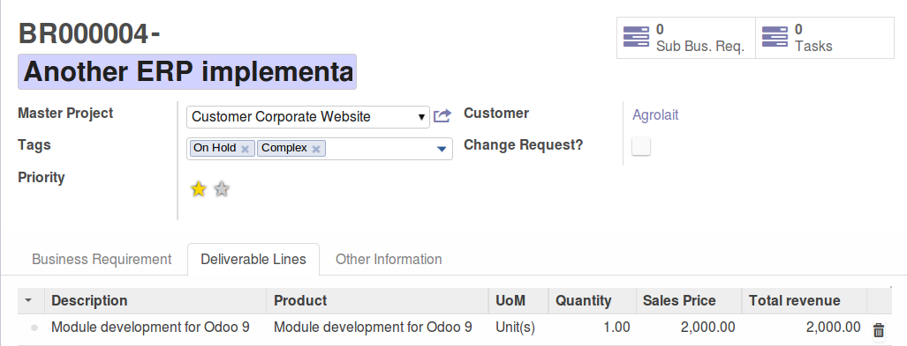

This module is part of a set of modules (`Business Requirements <https://github.com/OCA/business-requirement/blob/10.0/README.md>`_)

Two new concepts complement the main business requirements model:

* Deliverable lines
* Resource lines

A field for pricelist estimation is available in the partner to be used in Deliverable
and Resources lines valuation to customers.

What is a Deliverable Line?
---------------------------

Deliverable Lines (DL) contains products and services that will be delivered to the
customer. They are **customer oriented** and can be either physical or service products:

* Servers and procured goods
* Gap analysis services
* Module development services
* Training etc.

These are the products that will appear in the SO and that the customer/stakeholder will receive.

