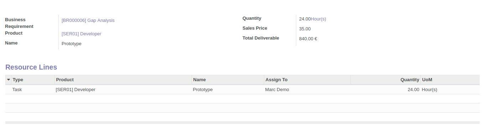

To use this module, you need to:

#. In the BR, you can add as many deliverable lines as necessary. Price of the deliverable 
   lines will depend on the pricelist(s) in customer.

#. Once the deliverable lines are created you can create as many resources lines as necessary
   in each DL. Cost price of the product will apply

#. in RL you can already assign the responsible of the task if necessary

