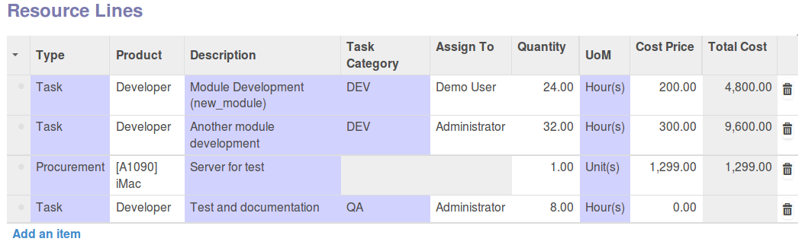

.. image:: https://img.shields.io/badge/licence-AGPL--3-blue.svg
   :target: http://www.gnu.org/licenses/agpl-3.0-standalone.html
   :alt: License: AGPL-3

==============================================
Business Requirement Resources Task Categories
==============================================

Introduction
============

This module is part of a set of modules (`Business Requirements <https://github.com/OCA/business-requirement/blob/8.0/README.md>`_).

This module introduces **Task Category** in the business requirements resource lines.

If module business_requirement_project is installed the category will be propagated 
to the task at project/task creation.

Configuration
=============

You can maintain the task categories in the Project/Configuration/Task category menu.

Usage
=====

#. In the Business requirement, you can add as many Deliverable Lines as necessary. Price of the Deliverable Lines will depend on the pricelist defined in master project or customer.

#. Once the Deliverable Lines are created, you can create as many Resource Lines as necessary in each Deliverable Lines.

#. in Resource Lines, you can then already assign task category on top of the assignee if necessary.

NB: Task category cannot be assigned to a procurement line.

.. image:: https://odoo-community.org/website/image/ir.attachment/5784_f2813bd/datas
   :alt: Try me on Runbot
   :target: https://runbot.odoo-community.org/runbot/222/8.0

Bug Tracker
===========

Bugs are tracked on `GitHub Issues <https://github.com/OCA/business-requirement/issues>`_.
In case of trouble, please check there if your issue has already been reported.
If you spotted it first, help us smashing it by providing a detailed and welcomed feedback.

Credits
=======

Contributors
------------

* Eric Caudal <eric.caudal@elico-corp.com>
* Victor M. Martin <victor.martin@elico-corp.com>

Maintainer
----------

.. image:: https://odoo-community.org/logo.png
   :alt: Odoo Community Association
   :target: https://odoo-community.org

This module is maintained by the OCA.

OCA, or the Odoo Community Association, is a nonprofit organization whose
mission is to support the collaborative development of Odoo features and
promote its widespread use.

To contribute to this module, please visit https://odoo-community.org.
