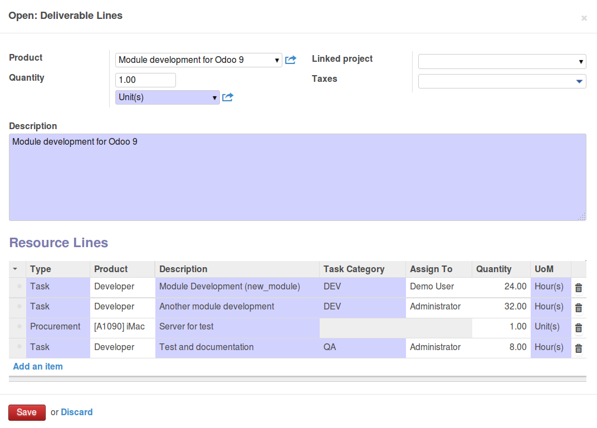
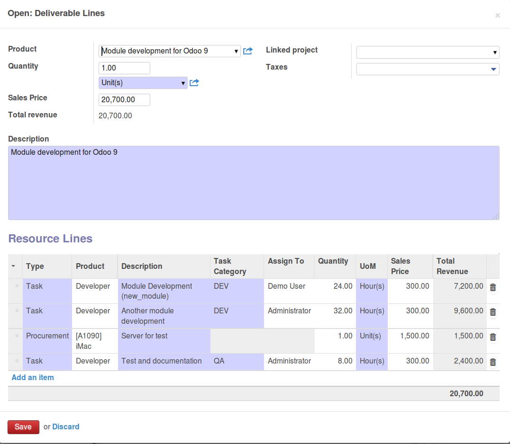

.. image:: https://img.shields.io/badge/licence-AGPL--3-blue.svg
   :target: https://www.gnu.org/licenses/agpl-3.0-standalone.html
   :alt: License: AGPL-3

=============================================
Business Requirement Deliverable Cost Control
=============================================

Introduction
============

This module is part of a set of modules (`Business Requirements <https://github.com/OCA/business-requirement/blob/10.0/README.md>`_)

This module improves the cost control of the original module with the following:

* Estimation sales price on resource lines. It provides a simple way to 
  calculate the sales price of the deliverable based on the necessary 
  resources lines (see usage).
* Adds ACL for sales price and resource cost confidentiality.
* Creates a tab Cost control in the Business Requirement for simple Gross Profit
  control.
* Multi-currency compatible: sales price is valued at currency Pricelist and 
  converted back to the reporting company currency for the cost control.

Configuration
=============

Users
-----

* **Business Requirement Sales Estimates**: Can See the sales prices in DL and RL (ideal for sales/presales)
* **Business Requirement Cost Control**: Can See the cost prices for project profit control (Manager/Finance dept)

Without Sales Estimate nor Cost Control rights:

Without Cost Control rights:

With both Sales Estimate and Cost Control rights:

.. figure:: static/img/bus_req_acl3.png
   :width: 600 px
   :alt: Full access to sales price and cost control (Financial dept)

Estimation Pricelist
--------------------

You can define the Estimation price list in the Master Project which will be 
used in deliverable lines and sales price for the resource lines.

Usage
=====

The pricelist stored in the Project/Estimation pricelist field will be used to help the calculation 
of the expected revenue of a Deliverable based on the sum of related RL.

#. In the BR, you can add as many deliverable lines as necessary. You can keep the price empty at that stage.

#. Once the deliverable lines are created you can create as many resources lines as necessary in each DL. 

#. in RL, the estimation sales price will be display per resource.

#. The total Revenue from the resources (sum of the sales estimation for all RL) can be manually added back to the deliverable line.

#. you can review the cost control tab of your BR as followed (only available for ACL Cost Control)

#. Eventually you can manually update the price of all resource clicking on the Update button.

.. figure:: static/img/bus_req_control.png
   :width: 600 px
   :alt: Control your cost for the BR

.. figure:: https://odoo-community.org/website/image/ir.attachment/5784_f2813bd/datas
   :alt: Try me on Runbot
   :target: https://runbot.odoo-community.org/runbot/222/10.0

Known issues / Roadmap
======================

* Display the currency in the cost control panel and deliverable
* As of version 10.0.1.0.0, the estimation pricelist has been moved from Project to
  Partner object. There is no migration script for the change and the data will have
  to be migrated manually.

Bug Tracker
===========

Bugs are tracked on `GitHub Issues <https://github.com/OCA/business-requirement/issues>`_.
In case of trouble, please check there if your issue has already been reported.
If you spotted it first, help us smashing it by providing a detailed and welcomed feedback.

Credits
=======

Contributors
------------

* Eric Caudal <eric.caudal@elico-corp.com>
* Alex Duan <alex.duan@elico-corp.com>
* Xie XiaoPeng <xie.xiaopeng@elico-corp.com>
* Luke Zheng <luke.zheng@elico-corp.com>
* Victor Martin <victor.martin@elico-corp.com>

Maintainer
----------

.. image:: https://odoo-community.org/logo.png
   :alt: Odoo Community Association
   :target: https://odoo-community.org

This module is maintained by the OCA.

OCA, or the Odoo Community Association, is a nonprofit organization whose
mission is to support the collaborative development of Odoo features and
promote its widespread use.

To contribute to this module, please visit https://odoo-community.org.
