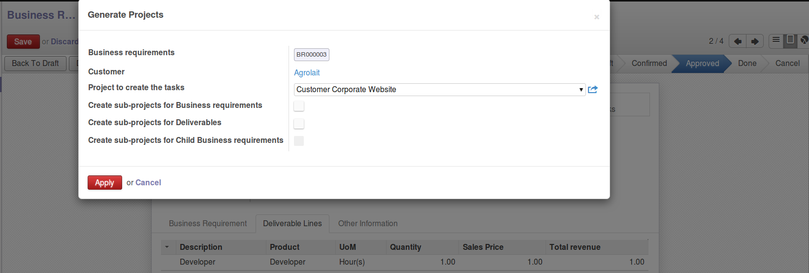

.. image:: https://img.shields.io/badge/licence-AGPL--3-blue.svg
   :target: https://www.gnu.org/licenses/agpl-3.0-standalone.html
   :alt: License: AGPL-3

==============================
Business Requirement - Project
==============================

Introduction
============

This module is part of a set of modules (`Business Requirements <https://github.com/OCA/business-requirement/blob/8.0/README.md>`_) 

This module contains 2 main wizards to create projects/tasks:

* Generate Project in the master project view
* Generate Project in the business requirement view

This module depends on:

* **business_requirement**: definition of business requirements
* **business_requirement_deliverable**: definition of deliverable and resources 
  lines, necessary to create the project information

Based on the information from business requirement and the resource lines the 
wizard will create:

* Projects and sub project based on BR and deliverable (optional)
* Tasks based on the resources lines set as tasks

Configuration
=============
Users
-----

Only Project Manager can have access to the wizard button.

Master project
--------------

You can define a master project linked to the business requirement.

The master project will be the parent of any project created via the wizard.

Usage
=====
Procedure
---------

#. Create multiple BR linked to one or several master projects
#. fill in the deliverables lines and corresponding resources lines (RL)
#. Properly define your RL description, time and assignee (used for task creation)
#. Confirm and Approve the Business Requirements
#. At that stage you can either

  #. Create the project in each business requirement via corresponding button
  #. Go to the master project and create the projects for all BR related to 
     the master project

#. The wizard is triggered and you can select the following option regarding the
   hierarchy of projects

  #. Parent project for creation
  #. Create sub-projects for Business requirements
  #. Create sub-projects for Deliverables
  #. Create sub-projects for Child Business requirements

Example
-------

eg: if a master project contains the following BR:

::

    BR1
    |
    |- Deliverable Line 1 (DL) containing 2 Resource Lines (RL):
    |  |
    |  |- RL1
    |  `- RL2
    |
    BR2
    |
    |- DL2
    |  |
    |  |- RL3
    |  `- RL4
    |
    |- DL3
    |  |
    |  |- RL5
    |  `- RL6
    |
    |- BR3 (Sub BR of BR2)
       |
       `- DL4
          `- RL7
    

In the Project creation wizard (above image), if no option is selected:

* No sub project created
* 7 tasks are created in the master project (for RL1~RL7)

If option 1 is selected:

* 3 sub projects (parent is Master project), one per BR
* 7 tasks are created for

  * in project linked to BR1 (2 tasks for RL1 and RL2),
  * in project linked to BR2 (4 tasks for RL3~6),
  * in project linked to BR3 (1 task for RL7)

If option 2 is selected:

* 4 sub projects (parent is Master project), one per DL
* 7 tasks are created for

  * in project linked to DL1 (2 tasks for RL1 and RL2),
  * in project linked to DL2 (2 tasks for RL3~4),
  * in project linked to DL3 (2 tasks for RL5~6) and
  * in project linked to DL4 (1 task for RL7)

If options 1+2 are selected:

* 7 sub projects (parent is Master project), one per BR and one per DL

  * BR1 sub-project contains DL1 sub-project,
  * BR2 sub-project contains DL2 and DL3 sub-projects,
  * BR3 sub-project contains DL4 sub-project

* 7 tasks are created for

  * in project linked to DL1 (2 tasks for RL1 and RL2),
  * in project linked to DL2 (2 tasks for RL3~4),
  * in project linked to DL3 (2 tasks for RL5~6) and
  * in project linked to DL4 (1 task for RL7)

If options 1+3 are selected:

* 7 sub projects (parent is Master project), one per BR and sub-BR

  * BR1 sub-project
  * BR2 sub-project contains BR3 sub-projects,

* 7 tasks are created for

  * in project linked to BR1 (2 tasks for RL1 and RL2),
  * in project linked to BR2 (4 tasks for RL3~6),
  * in project linked to BR3 (1 task for RL7)

If options 1+2+3 are selected:

* 7 sub projects (parent is Master project), one per BR, sub-BR and DL

  * BR1 sub-project contains DL1 sub-project,
  * BR2 sub-project contains BR3, DL2 and DL3 sub-projects,
  * BR3 sub-project contains DL4 sub-project

* 7 tasks are created for

  * in project linked to DL1 (2 tasks for RL1 and RL2),
  * in project linked to DL2 (2 tasks for RL3~4),
  * in project linked to DL3 (2 tasks for RL5~6) and
  * in project linked to DL4 (1 task for RL7)

.. image:: https://odoo-community.org/website/image/ir.attachment/5784_f2813bd/datas
   :alt: Try me on Runbot
   :target: https://runbot.odoo-community.org/runbot/222/8.0

Bug Tracker
===========

Bugs are tracked on `GitHub Issues <https://github.com/OCA/business-requirement/issues>`_.
In case of trouble, please check there if your issue has already been reported.
If you spotted it first, help us smashing it by providing a detailed and welcomed feedback.

Credits
=======

Contributors
------------

* Eric Caudal<eric.caudal@elico-corp.com>
* Alex Duan<alex.duan@elico-corp.com>
* Xie XiaoPeng<xie.xiaopeng@elico-corp.com>
* Victor M. Martin <victor.martin@elico-corp.com>

Maintainer
----------

.. image:: https://odoo-community.org/logo.png
   :alt: Odoo Community Association
   :target: https://odoo-community.org

This module is maintained by the OCA.

OCA, or the Odoo Community Association, is a nonprofit organization whose
mission is to support the collaborative development of Odoo features and
promote its widespread use.

To contribute to this module, please visit https://odoo-community.org.
