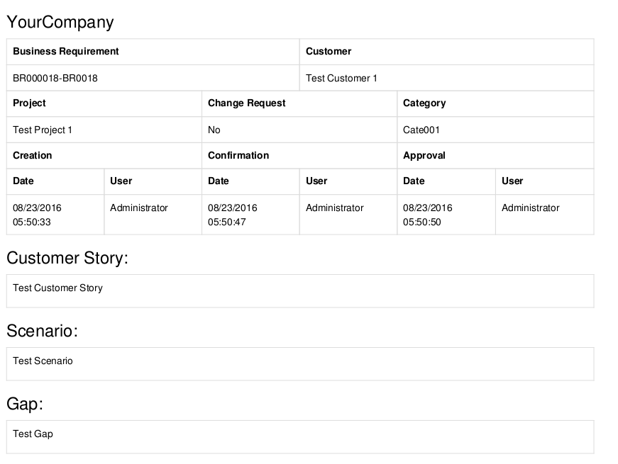
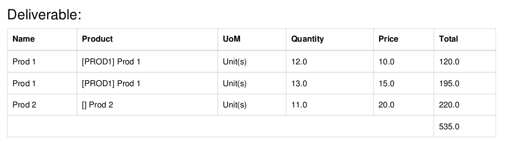
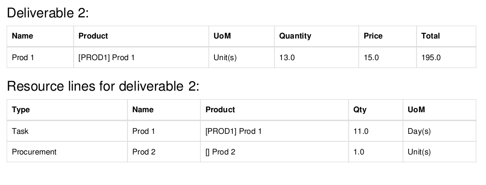

.. figure:: https://img.shields.io/badge/licence-AGPL--3-blue.svg
   :target: http://www.gnu.org/licenses/agpl-3.0-standalone.html
   :alt: License: AGPL-3

======================================
Business Requirement Document Printout
======================================

Introduction
============

This module is part of a set of modules (`Business Requirements <https://github.com/OCA/business-requirement/blob/8.0/README.md>`_) 

This module adds multiple printouts to the deliverable modules:

* **Business requirement Document**: including header, Customer story, 
  scenario and gap analysis

* **Business requirement Document with Deliverables**: above printout including the deliverable lines at 
  sales price

* **Business requirement Document with Deliverables and Resources**: above printout including the resource lines with 
  expected quantity

Usage
=====

Select the BR and print desired report.

.. figure:: https://odoo-community.org/website/image/ir.attachment/5784_f2813bd/datas
   :alt: Try me on Runbot
   :target: https://runbot.odoo-community.org/runbot/222/8.0

Bug Tracker
===========

Bugs are tracked on `GitHub Issues <https://github.com/OCA/business-requirement/issues>`_.
In case of trouble, please check there if your issue has already been reported.
If you spotted it first, help us smashing it by providing a detailed and welcomed feedback.

Credits
=======

Contributors
------------

* Eric Caudal <eric.caudal@elico-corp.com>
* Evan Li <li.aiwen@elico-corp.com>

Maintainer
----------

.. figure:: https://odoo-community.org/logo.png
   :alt: Odoo Community Association
   :target: https://odoo-community.org

This module is maintained by the OCA.

OCA, or the Odoo Community Association, is a nonprofit organization whose
mission is to support the collaborative development of Odoo features and
promote its widespread use.

To contribute to this module, please visit https://odoo-community.org.
