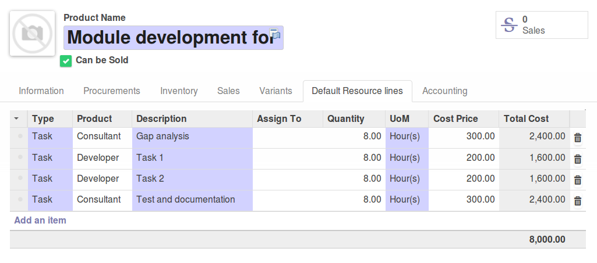

.. figure:: https://img.shields.io/badge/licence-AGPL--3-blue.svg
   :target: https://www.gnu.org/licenses/agpl-3.0-standalone.html
   :alt: License: AGPL-3

====================
Business Requirement
====================

Introduction
============

This module is part of a set of modules (`Business Requirements <https://github.com/OCA/business-requirement/blob/10.0/README.md>`_)

This module adds the following features particularly useful for sales package with standard resources:

* In Product template, a new tab "Resources" with the resource lines management 
  (You could add, delete or create new resources).
* Possibility to create default resource lines for a given deliverable product. Those resource 
  lines will be automatically added to the BR when the deliverable product is selected.
* This allows the user to have standard resource lines uploaded in the BR for deliverable 
  packages.

Configuration
=============

Users
-----

No special ACL set up

Default resources in Deliverable Product
----------------------------------------

You can create Deliverable products and add in them standard resource lines
expected to be added in the Business requirement by default.
Depending on the modules you are using for the business requirements, the 
content of the resources lines will reflect the expected resources lines in the 
BR.

Usage
=====

#. Prepare your deliverables in the Product menu and add the expected RL

#. Create a new BR and add the deliverable product in the deliverable line

#. Adapt the resources lines if necessary

.. figure:: static/img/bus_req_default2.png
   :width: 600 px
   :alt: The default resource lines are automatically added to your BR

.. figure:: https://odoo-community.org/website/image/ir.attachment/5784_f2813bd/datas
   :alt: Try me on Runbot
   :target: https://runbot.odoo-community.org/runbot/222/10.0

Known issues / Roadmap
======================

* Currently prices are not updated when the resource lines are uploaded in the 
  BR. => Add a button to recalculate Sales estimation prices in the Deliverable 
  line

Bug Tracker
===========

Bugs are tracked on `GitHub Issues <https://github.com/OCA/
project/issues>`_.
In case of trouble, please check there if your issue has already been reported.
If you spotted it first, help us smashing it by providing a detailed and welcomed feedback.

Credits
=======

Contributors
------------

* Eric Caudal <eric.caudal@elico-corp.com>
* Victor M. Martin <victor.martin@elico-corp.com>

Maintainer
----------

.. image:: https://odoo-community.org/logo.png
   :alt: Odoo Community Association
   :target: https://odoo-community.org

This module is maintained by the OCA.

OCA, or the Odoo Community Association, is a nonprofit organization whose
mission is to support the collaborative development of Odoo features and
promote its widespread use.

To contribute to this module, please visit https://odoo-community.org.
