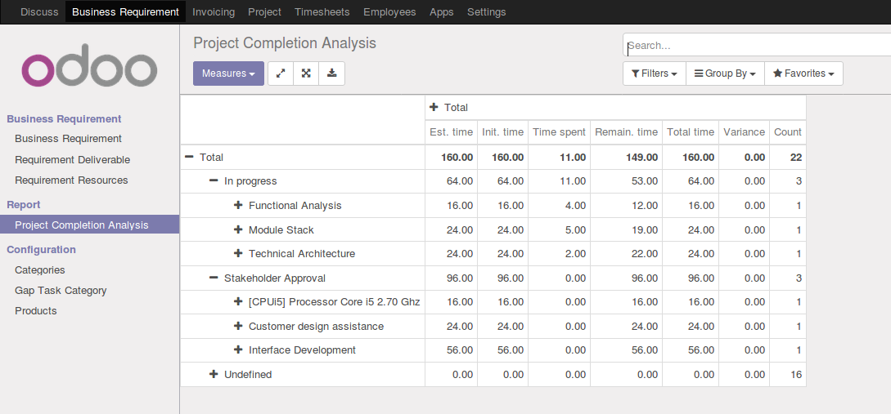

.. image:: https://img.shields.io/badge/licence-AGPL--3-blue.png
   :target: https://www.gnu.org/licenses/agpl
   :alt: License: AGPL-3

=================================
Business Requirement Earned Value
=================================

Introduction
============

This module is part of a set of modules (`Business Requirements <https://github.com/OCA/business-requirement/blob/10.0/README.md>`_)

This module creates a report that allows you to follow-up the
completion of a project by comparing the estimated time and the
time actually spent in the timesheets.

Usage
=====

To use this module, you need to:

#. Go to Business Requirement > Report > Project Completion Report

.. image:: https://odoo-community.org/website/image/ir.attachment/5784_f2813bd/datas
   :alt: Try me on Runbot
   :target: https://runbot.odoo-community.org/runbot/222/10.0

Known issues / Roadmap
======================

* Current UoM conversion works only for Days and Hours (standard UoM): if other time UoM were to be added the SQL view would need to be made more generic.

Bug Tracker
===========

Bugs are tracked on `GitHub Issues
<https://github.com/OCA/business-requirement/issues>`_. In case of trouble, please
check there if your issue has already been reported. If you spotted it first,
help us smashing it by providing a detailed and welcomed feedback.

Credits
=======

Images
------

* Odoo Community Association: `Icon <https://github.com/OCA/maintainer-tools/blob/master/template/module/static/description/icon.svg>`_.

Contributors
------------

* Sebastien Maillard <sebastien.maillard@elico-corp.com>
* Eric Caudal <eric.caudal@elico-corp.com>

Maintainer
----------

.. image:: https://odoo-community.org/logo.png
   :alt: Odoo Community Association
   :target: https://odoo-community.org

This module is maintained by the OCA.

OCA, or the Odoo Community Association, is a nonprofit organization whose
mission is to support the collaborative development of Odoo features and
promote its widespread use.

To contribute to this module, please visit https://odoo-community.org.
